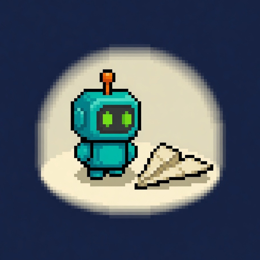
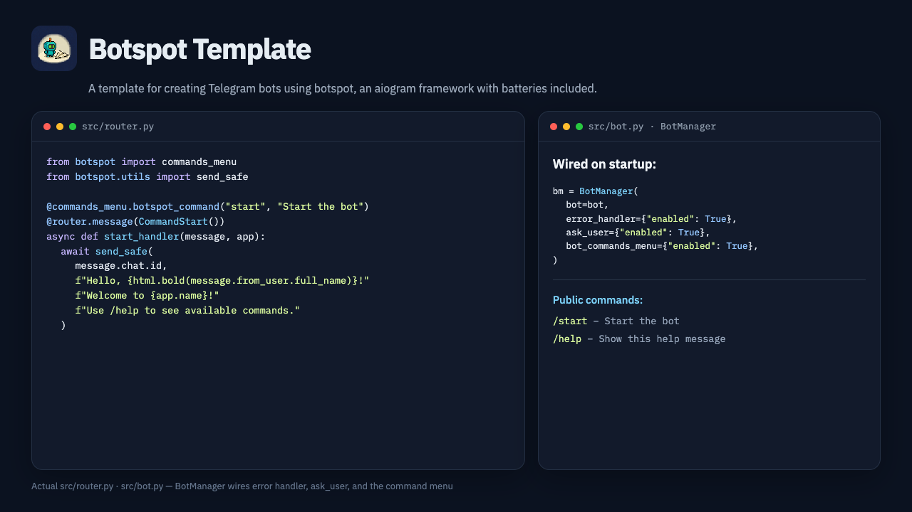

<h1 align="center">
   Botspot Template
</h1>

<p align="center">
  <strong>A template for creating Telegram bots using botspot, an aiogram framework with batteries included.</strong>
</p>

<p align="center">
  <a href="https://github.com/calmmage/botspot-template"></a>
  <a href="https://github.com/calmmage/botspot-template/actions/workflows/push-checks.yml"></a>
  <a href="LICENSE"></a>
  
  
</p>

<p align="center">
  <a href="https://github.com/calmmage/botspot"><kbd>botspot</kbd></a>
  &nbsp;
  <a href="https://docs.aiogram.dev"><kbd>aiogram</kbd></a>
  &nbsp;
  <a href="https://core.telegram.org/bots"><kbd>Telegram Bot API</kbd></a>
</p>

<h3 align="center"><a href="#install"><ins>Use this template</ins></a></h3>

<p align="center">
  <a href="docs/examples/hero.png"></a>
</p>

Clone, set a bot token, run. [botspot](https://github.com/calmmage/botspot) wires the command menu, error handler, and `send_safe` into your [aiogram](https://docs.aiogram.dev) dispatcher.

## Install

Needs **Python ≥ 3.12**, **[uv](https://docs.astral.sh/uv/)**, **make**, and a bot token from [@BotFather](https://t.me/BotFather).

GitHub: **[Use this template](https://github.com/calmmage/botspot-template/generate)**. Or clone:

```bash
git clone https://github.com/calmmage/botspot-template.git your-bot-name
cd your-bot-name
make wizard                 # help, then make setup (uv sync + doctor)
cp example.env .env         # set TELEGRAM_BOT_TOKEN
make run                    # uv run python run.py
```

Equivalent live start: `uv run python run.py`. `make setup` is the only install path. Done when `make doctor` prints `cli: ok`. Doctor and `make test` need no Telegram token.

Enable components in `.env`; see `example.env` for names.

**Agents:** follow **[AGENTS.md](AGENTS.md)** in this repo, **[botspot AGENTS.md](https://github.com/calmmage/botspot/blob/main/AGENTS.md)** for the library, and **[botspot_101.md](botspot_101.md)** for component snippets.

### Give this to an agent

Paste:

> Clone https://github.com/calmmage/botspot-template and follow **[AGENTS.md](AGENTS.md)**. Install [uv](https://docs.astral.sh/uv/) if missing. Do not invent an install path. A Telegram bot token from [@BotFather](https://t.me/BotFather) is the human's — put it in `.env` as `TELEGRAM_BOT_TOKEN`. Then `make wizard`, `cp example.env .env`, and `make run`.

## What you get

| Surface | What it is |
|---------|------------|
| **App** | `src/app.py` — typed `AppConfig` (`TELEGRAM_BOT_TOKEN`) |
| **Bot** | `src/bot.py` — `BotManager` enables error handler, `ask_user`, command menu, LLM provider, then polling |
| **Router** | `src/router.py` — `@botspot_command` `/start`, `/help`, `/ask`, friends-only |
| **Config** | `example.env` — every current botspot component prefix |
| **Tests** | `make test` — `uv run pytest tests/` |
| **Docker** | `Dockerfile` runs `uv run python run.py` |

## Project structure

```
.
├── src/
│   ├── app.py           # AppConfig + App
│   ├── bot.py           # BotManager + polling
│   ├── router.py        # commands (visibility, t(), /ask, friends-only)
│   ├── i18n.py          # botspot t() strings (en/ru)
│   └── __init__.py
├── run.py               # entry point (make run / docker)
├── docs/examples/       # logo, favicon, hero screenshot
├── example.env          # component flags (placeholders only)
├── botspot_101.md       # component snippets
├── AGENTS.md            # agent install wizard
├── Makefile             # wizard / setup / doctor / check / test / run
├── Dockerfile
└── pyproject.toml
```

## Docs

| | |
|---|---|
| This page, install, screenshot | [README.md](README.md) |
| In-repo docs index | [docs/index.md](docs/index.md) |
| Component snippets | [botspot_101.md](botspot_101.md) |
| Agent install | [AGENTS.md](AGENTS.md) |
| Library | [calmmage/botspot](https://github.com/calmmage/botspot) · [AGENTS.md](https://github.com/calmmage/botspot/blob/main/AGENTS.md) |
| Vulnerability reports | [SECURITY.md](SECURITY.md) |

Docs stay in this repository and are linked from the README. GitHub Pages is not used.

```bash
make wizard   # install
make doctor   # cli: ok
make test     # pytest, no token
make run      # needs .env
```

## License

GPL-3.0 — see [LICENSE](LICENSE). Vulnerabilities: [SECURITY.md](SECURITY.md).
